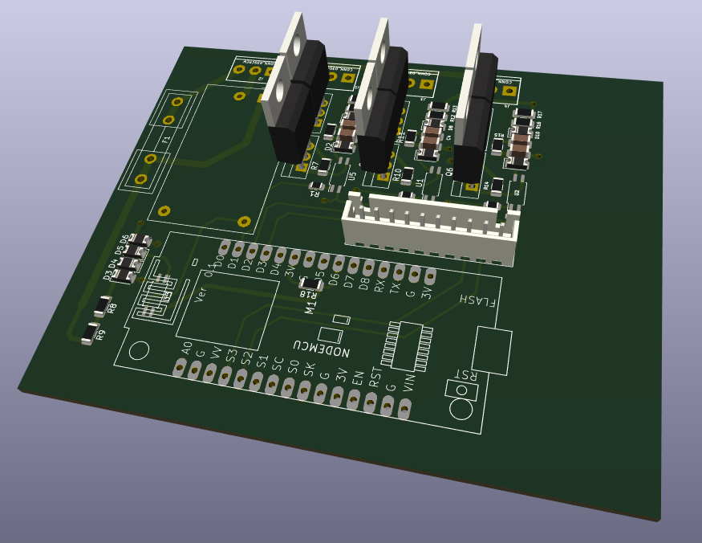

# Trailing Edge Dimmer Description

Practically there are 2 types of dimmer. 

1. Raising Edge
2. Trailing Edge

Based on the swithing time position after zero cross detection. 

Here is a simple concept of raising and trailing edge switching.

This project focused on trailing edge dimmer construction. 

Here it stores energy in C5 and C6 from power line ACL and ACN. From the perspective it only uses positive cycle of the phase to store energy. Turning on the mosfet is occured by Opto U2, and turning off is happened by R14 (10k) . So this dimmer is not suitable for more than 200W. 

Found another solution as below:

This 3 channel dimmer is build on ESP8266 NodeMCU . Complete Kicad Drawing is available in [https://github.com/jibonaronno/kicad_projects/tree/main/dimmer_trailing_edge/nodemcu01](https://github.com/jibonaronno/kicad_projects/tree/main/dimmer_trailing_edge/nodemcu01)